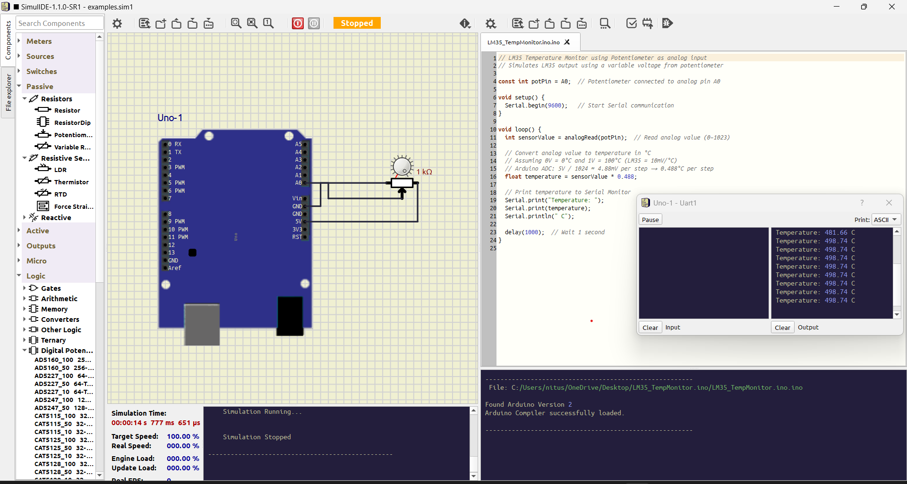

# AnalogTempMonitor_SimulatedLM35

## 🔧 Overview
This Arduino Uno project simulates an LM35 temperature sensor using a potentiometer to mimic analog voltage input. It reads the voltage, converts it to temperature in °C, and displays the result via Serial Monitor or 16x2 LCD in SimulIDE.

## 🧪 Simulation Setup
- **Platform**: SimulIDE (lightweight circuit simulator)
- **Sensor**: Potentiometer (simulating LM35 output)
- **Board**: Arduino Uno
- **Display Options**:
  - Serial Monitor (default)
  - 16x2 LCD (optional, parallel mode)

## 📐 Circuit Diagram
  
  
*SimulIDE screenshot showing Arduino Uno, potentiometer, and LCD wiring.*

## 📄 Code Logic
- `analogRead()` reads voltage from A0
- Conversion formula: `temperature = sensorValue * 0.488`
- Output options:
  - Serial Monitor: `Serial.print("Temperature: ...")`
  - LCD: `lcd.print("Temp: ...")`

## 📁 Files Included
- `AnalogTempMonitor_SimulatedLM35.ino` — Arduino sketch
- `schematic.png` — SimulIDE circuit screenshot
- `demo_video.mp4` — Simulation walkthrough
- `docs/explanation.txt` — Notes on conversion logic and simulation strategy

## 📚 Notes
This project is part of a semester-wise portfolio focused on embedded systems and simulation-first prototyping. It demonstrates analog input handling, basic UI integration, and modular documentation practices.It is just an basic project where i had simulated LM35 sensor with an potentiometer.  I had used potentiometer because currently SimulIde does not had LM35 sensor so i had to chose potentiometer if in future it supports i will update and modify code.

Steps are explained in `doc\explanation.txt`